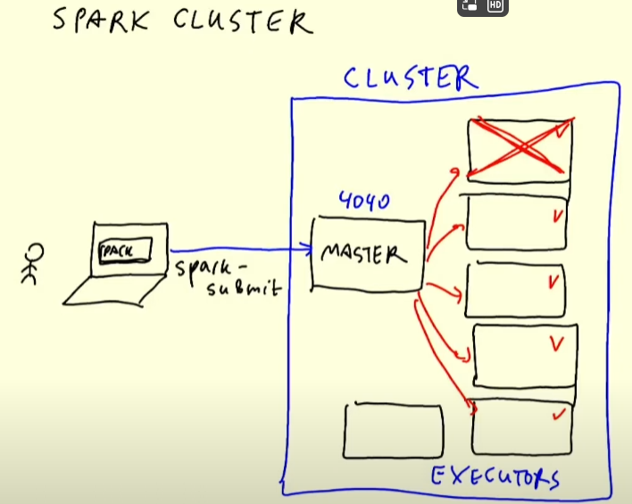
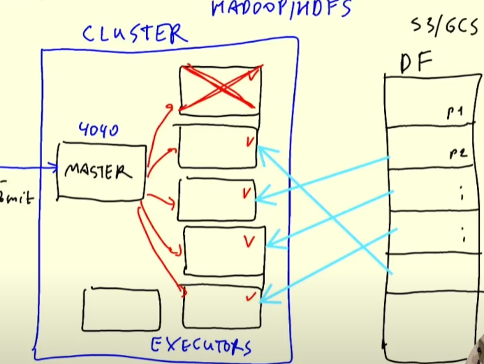
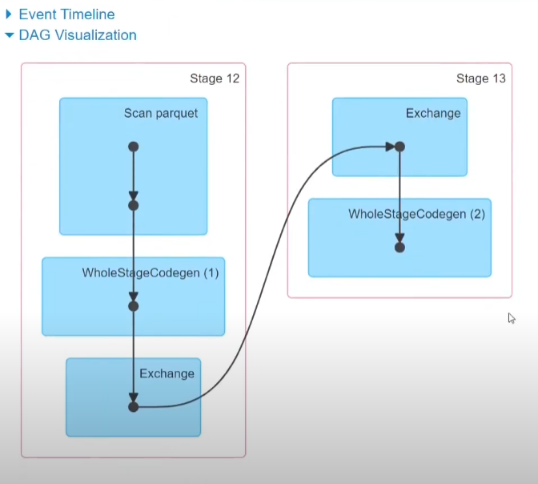
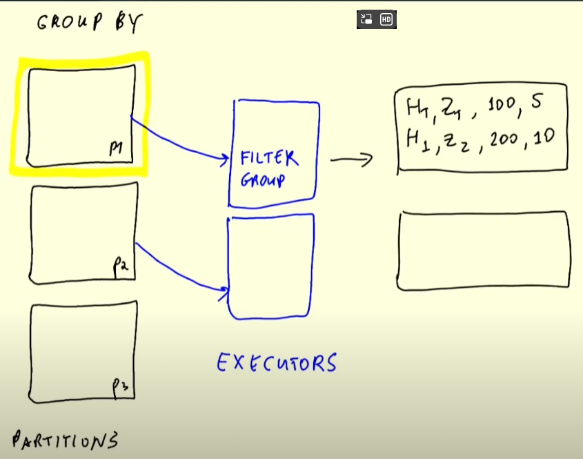
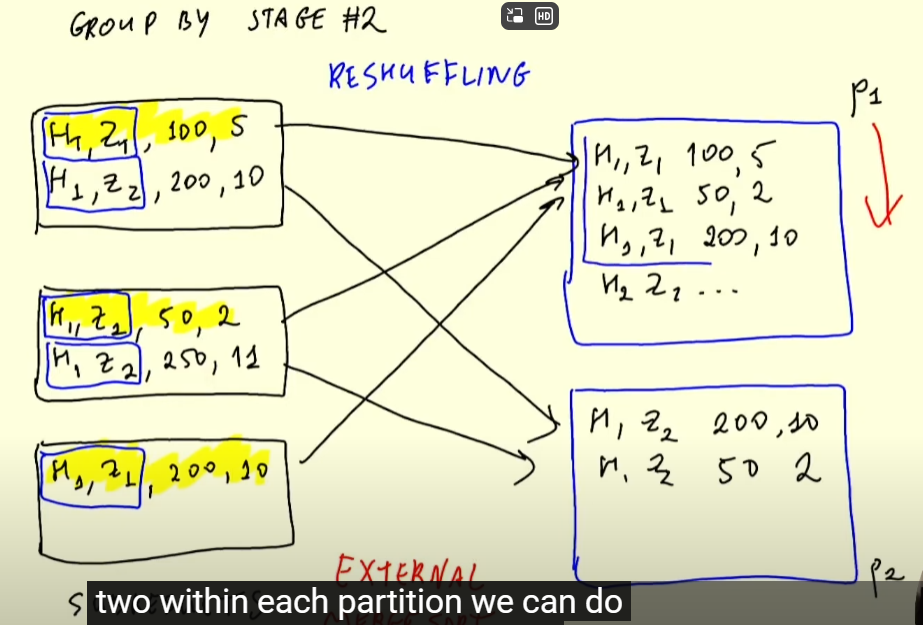
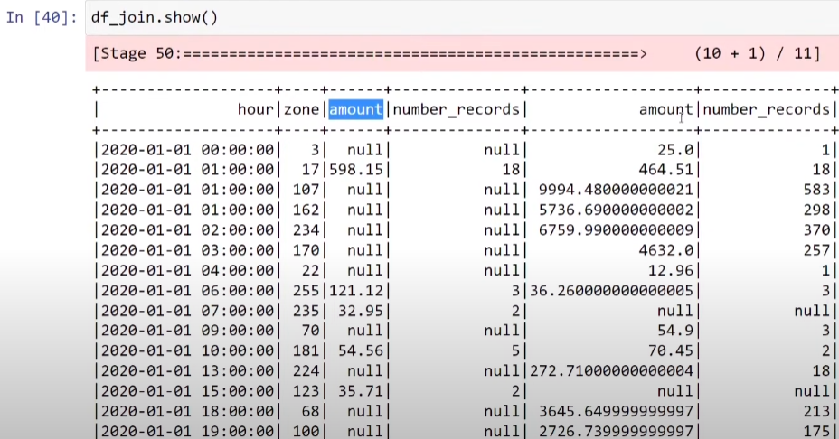
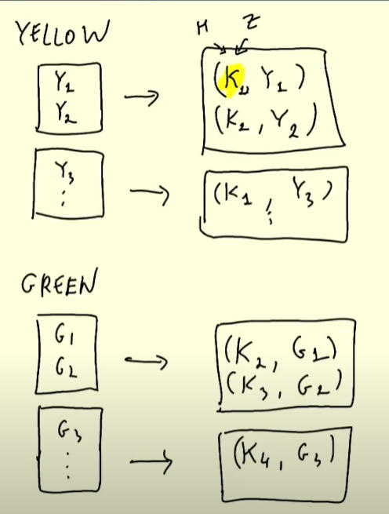
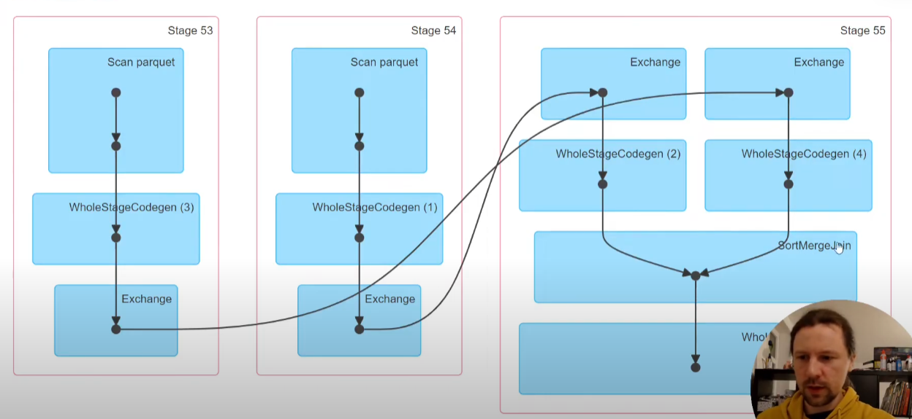
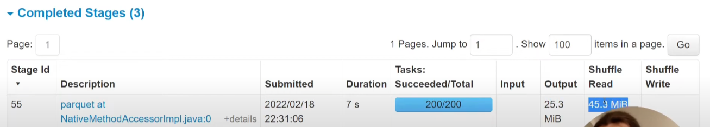

# Batch Processing with Apache Spark


[Source Code](python/)

### Install Java
```
$ cd ~/
$ mkdir spark
$ cd spark
$ wget https://download.java.net/java/GA/jdk11/9/GPL/openjdk-11.0.2_linux-x64_bin.tar.gz
$ tar xzfv openjdk-11.0.2_linux-x64_bin.tar.gz
```

- Permanently add the path to the shell configuration 
```
$ nano ~/.bashrc

export JAVA_HOME="${HOME}/spark/jdk-11.0.2"
export PATH="${JAVA_HOME}/bin:${PATH}"
```
- Save the file open a new bash and terminal check the version. 

```
$ java --version
```

### Install Spark
```
$ wget https://dlcdn.apache.org/spark/spark-3.3.2/spark-3.3.2-bin-hadoop3.tgz
$ tar xzfv spark-3.3.2-bin-hadoop3.tgz
$ rm spark-3.3.2-bin-hadoop3.tgz
```
- Add the variables to the path using the  ~/.bashrc file

```
export SPARK_HOME="${HOME}/spark/spark-3.3.2-bin-hadoop3"
export PATH="${SPARK_HOME}/bin:${PATH}"

```

- Run a quick test 
Run spark-shell and run the following:

```
val data = 1 to 10000
val distData = sc.parallelize(data)
distData.filter(_ < 10).collect()
```


### Configure PySpark Path

- To run PySpark, we first need to add it to PYTHONPATH using the  ~/.bashrc file

**Note: Validate the name of the py4j* file**

```
export PYTHONPATH="${SPARK_HOME}/python/:$PYTHONPATH"
export PYTHONPATH="${SPARK_HOME}/python/lib/py4j-0.10.9.5-src.zip:$PYTHONPATH"
```

**Note: Make sure that the version under ${SPARK_HOME}/python/lib/ matches the filename of py4j or you will encounter ModuleNotFoundError: No module named 'py4j' while executing import pyspark.**

### Test PySpark

Download the csv file into the data folder and run the python script

```
  $ spark-shell
  $ wget https://s3.amazonaws.com/nyc-tlc/misc/taxi+_zone_lookup.csv
  $ python3 python/load_zone_lookup.py

```  

- PySpark Load Zones


- Test Scale SQL


### Anatomy of a Spark Cluster
Spark cluster
```
import pyspark
from pyspark.sql import SparkSession

spark = SparkSession.builder \
    .master("local[*]") \ create the local cluster
    .appName('test') \
    .getOrCreate()
```

A spark cluster have a spark master, and we use spark submit to  send the code and packages to the spark master. The spark master will distribute the code to the executors.

The executors will pull data, process. Imagine a DF that partitioned into multiple partitions, these DF using live in S3, GCS


### GroupBy in Spark
```
df_green_revenue = spark.sql("""
SELECT 
    date_trunc('hour', lpep_pickup_datetime) AS hour, 
    PULocationID AS zone,

    SUM(total_amount) AS amount,
    COUNT(1) AS number_records
FROM
    green
WHERE
    lpep_pickup_datetime >= '2020-01-01 00:00:00'
GROUP BY
    1, 2
""")
```
The code and DAG from spark job for understanding the group by in spark


The first stages is preparing the data for the group by, then the group by is executed

since the first executor working on the 1st partition, it run the group by in that partition and output the result. All partitions will have a result, but we need to somehow combine them into 1. Intermediate results(result from each partition) 

Reshuffling, using External Merge Sort algoithm, we will have 2 partiions, and then group all records with the same key into the same partition. As the result, the output will be reduced. Instead 3 records with the same key, we will have 1 record with the same key as the combined result. In practice, we want to minimize the number of reshuffles because it is a very expensive operation to move a lot of data around.



### Joins in Spark
```
df_green_revenue = spark.sql("""
SELECT 
    date_trunc('hour', lpep_pickup_datetime) AS hour, 
    PULocationID AS zone,

    SUM(total_amount) AS amount,
    COUNT(1) AS number_records
FROM
    green
WHERE
    lpep_pickup_datetime >= '2020-01-01 00:00:00'
GROUP BY
    1, 2
""")

df_yellow_revenue = spark.sql("""
SELECT 
    date_trunc('hour', tpep_pickup_datetime) AS hour, 
    PULocationID AS zone,

    SUM(total_amount) AS amount,
    COUNT(1) AS number_records
FROM
    yellow
WHERE
    tpep_pickup_datetime >= '2020-01-01 00:00:00'
GROUP BY
    1, 2
""")

df_green_revenue \
    .repartition(20) \
    .write.parquet('data/report/revenue/green', mode='overwrite')

df_yellow_revenue \
    .repartition(20) \
    .write.parquet('data/report/revenue/yellow', mode='overwrite')
```
To join df_green_revenue and df_yellow_revenue on 2 columns: hours, zones, we will have a 6 columns table,



we can see we need to rename columns in table df_green_revenue, df_yellow_revenue

```
df_green_revenue_tmp = df_green_revenue \
    .withColumnRenamed('amount', 'green_amount') \
    .withColumnRenamed('number_records', 'green_number_records')

df_yellow_revenue_tmp = df_yellow_revenue \
    .withColumnRenamed('amount', 'yellow_amount') \
    .withColumnRenamed('number_records', 'yellow_number_records')
```
#### complex record creation and reshuffling

Everything with Key: for each record with the same key K_n will go to the same partition, and then we will have a combined result. If there only 1 K_n, it will be output with the key, depend on the types on the join, the output will be either null, or remove


External Merge Sort 


#### Materializing results for efficient processing 
Save the result to the disk, and then we can use the result to join with other tables, or we can use the result to do other operations. Instead of doing chain operation
#### Joining large tables, small tables


## Homework

- Download the test data

```
$ cd python
$ python web_to_local.py --prefix=fhvhv_tripdata --year=2021 --month=6 --url=https://github.com/DataTalksClub/nyc-tlc-data/releases/download/fhvhv
```

- Create the Spark session and read the version

```

spark = SparkSession.builder \
    .master("local[*]") \
    .appName('process-taxi-data') \
    .getOrCreate()

# Q1 spark version
print(f"Spark Version - {spark.version}")

```

- Create the parquet files with 12 partitions

```

schema = types.StructType([
    types.StructField('hvfhs_license_num', types.StringType(), True),
    types.StructField('dispatching_base_num', types.StringType(), True),
    types.StructField('pickup_datetime', types.TimestampType(), True),
    types.StructField('dropoff_datetime', types.TimestampType(), True),
    types.StructField('PULocationID', types.IntegerType(), True),
    types.StructField('DOLocationID', types.IntegerType(), True),
    types.StructField('SR_Flag', types.StringType(), True),
    types.StructField('Affiliated_base_number', types.StringType(), True)
])
#  Load the dataframe
file_path = '../data/fhvhv_tripdata/fhvhv_tripdata_2021-06.csv.gz'
print(f"Reading - {file_path}")

df = spark.read \
    .option("header", "true") \
    .schema(schema) \
    .csv(file_path)

#  Partition the data frame
folder_path = '../data/fhvhv'
print(f"Creating partitions - 12 folder {folder_path}")
df.head()
df = df.repartition(12)
df.write.mode('overwrite').parquet(folder_path, compression='gzip')

```

- Using the terminal, check the size of the files and write to a log file

```
$ ls -al ../data/fhvhv/*.parquet >>  size.log
```


- Q3: How many taxi trips were there on June 15 2021?

```
pickup_dt = '2021-06-15'
from pyspark.sql import functions as F
df \
    .withColumn('pickup_date', F.to_date(df.pickup_datetime)) \
    .filter(f"pickup_date = {pickup_dt}") \
    .count()

# using SQL syntax

df.createOrReplaceTempView('fhvhv_tripdata')
spark.sql(f"""
SELECT
    COUNT(1)
FROM 
    fhvhv_tripdata
WHERE
    to_date(pickup_datetime) = {pickup_dt};
""").show()
```

- Q4: Longest trip for each day

```
df.columns
['hvfhs_license_num',
 'dispatching_base_num',
 'pickup_datetime',
 'dropoff_datetime',
 'PULocationID',
 'DOLocationID',
 'SR_Flag']
df \
    .withColumn('duration', (df.dropoff_datetime.cast('long') - df.pickup_datetime.cast('long'))/( 60 * 60 )) \
    .withColumn('pickup_date', F.to_date(df.pickup_datetime)) \
    .groupBy('pickup_date') \
        .max('duration') \
    .orderBy('max(duration)', ascending=False) \
    .limit(5) \
    .show()

spark.sql("""
SELECT
    to_date(pickup_datetime) AS pickup_date,
    MAX((CAST(dropoff_datetime AS LONG) - CAST(pickup_datetime AS LONG)) / (60 * 60)) AS duration
FROM 
    fhvhv_tripdata
GROUP BY
    1
ORDER BY
    2 DESC
LIMIT 5;
""").show()
```

- Q5 Spark’s User Interface which shows application's dashboard runs on which local port?


- Q6 Using the zone lookup data and the fhvhv June 2021 data, what is the name of the most frequent pickup location zone

```
zones_path = '../data/zones'
df_zones = spark.read.parquet(zones_path)
df_zones.columns
['LocationID', 'Borough', 'Zone', 'service_zone']

df_zones.createOrReplaceTempView('zones_data')
spark.sql("""
SELECT
   pul.Zone,
   COUNT(1) as Total
FROM 
    fhvhv_tripdata fhv 
    INNER JOIN zones_data pul ON fhv.PULocationID = pul.LocationID    
GROUP BY 
    1
ORDER BY
    2 DESC
LIMIT 5;
""").show()
```